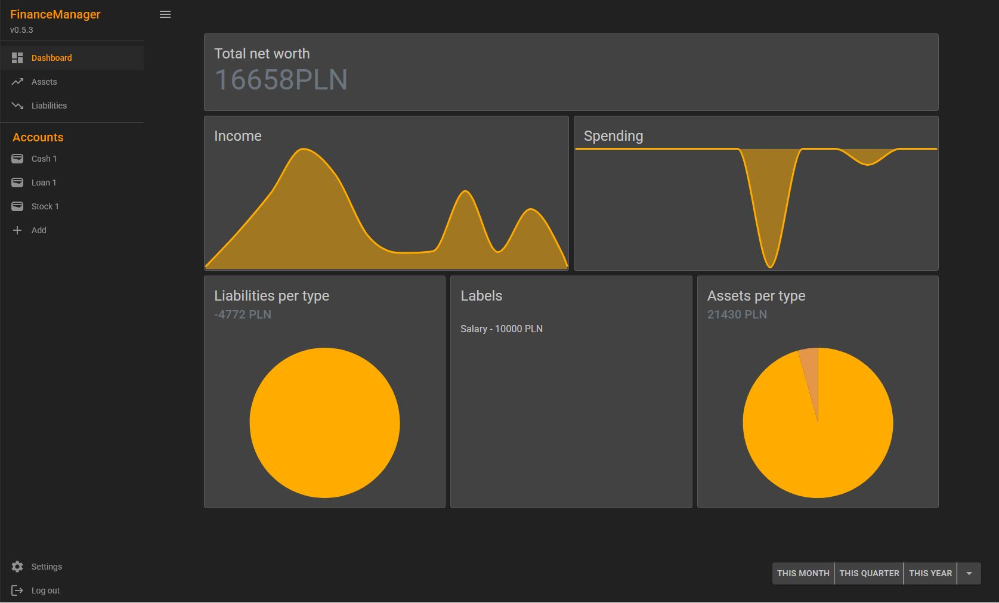

# Hi — I'm Mikołaj Karkowski 👋

Full-stack .NET engineer focused on building productive, maintainable desktop and web applications.

- 🔭 I'm currently working on: **Finance Manager** — a personal budgeting application built with Blazor.  
- 🌱 I'm learning and improving: advanced Blazor patterns, desktop app UX with WPF, and robust API design.  
- 💬 Ask me about: Blazor, WPF, REST APIs, .NET architecture and app performance.  
- ⚡ Fun fact: my hobby is photography — I enjoy capturing landscapes and street scenes.

---

## What I build
I design and implement end-to-end solutions across desktop and web: rich WPF clients, Blazor web apps, and reliable APIs. I favour clear architecture, strong typing, and pragmatic automation (tests & CI).

- Desktop: WPF, MVVM patterns, responsive UI for Windows users  
- Web: Blazor (client & server) for interactive, component-driven experiences  
- APIs: RESTful APIs with .NET, secure endpoints and clean versioning

---

## Tech Stack (top skills)
- Blazor  
- WPF  
- APIs (ASP.NET / .NET Web API)  
- C# / .NET 6+  
- EF Core, SQLite / PostgreSQL  
- Git & GitHub, CI pipelines

---

## Featured Project

### Finance Manager
A personal budgeting application to help track expenses, plan budgets, and visualise financial health. Built with Blazor (frontend) and .NET APIs, focusing on a clean UX and reliable data handling.

Live app: https://avresial.github.io/FinanceManager  
Repository: https://github.com/avresial/FinanceManager  
Description: Personal project - Blazor WASM application for managing assets and investments.

---

## Open to work
Yes — available for roles as a Fullstack .NET Developer (desktop + web).

---

## Contact & Socials
- LinkedIn: https://www.linkedin.com/in/miko%C5%82aj-karkowski/

---

## GitHub Stats
  

---

## How to collaborate with me
- Open an issue or PR on the repo you want help with.  
- I prefer small, focused PRs with tests and clear descriptions.  
- For hiring or consulting, reach out on LinkedIn.

---

Thanks for stopping by — feel free to follow for updates on Finance Manager and other projects. 🚀
