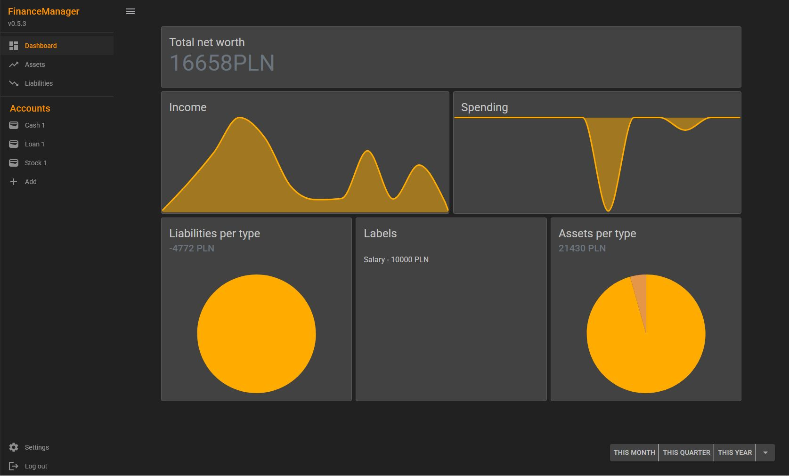

# Hi — I'm Mikołaj Karkowski 👋

Full-stack .NET engineer building maintainable, AI-augmented web and desktop applications. I care about clean architecture, strong typing, and pragmatic automation.

- 🔭 Currently working on: **[FinanceManager](https://github.com/avresial/FinanceManager)** — an open-source personal finance tracker on **.NET 10 / Blazor WebAssembly** with AI-powered insights and live market data.
- 🌱 Currently learning: **modular monolith architecture**, **DDD + CQRS**, event-driven systems, and integrating LLMs into production .NET apps via `Microsoft.Extensions.AI`.
- 🧰 Ask me about: Blazor, ASP.NET Core, .NET Aspire, EF Core, SignalR, AI provider chains, layered architecture, WPF/MVVM.
- 📸 Fun fact: my hobby is photography — landscapes and street scenes.

---

## What I build

I design and ship end-to-end .NET solutions: interactive Blazor web apps, REST/SignalR APIs, and rich WPF desktop clients. I prefer clear boundaries (domain layer with zero infrastructure dependencies), typed HTTP clients, background services for async work, and provider fallback chains so the app keeps working when an external service does not.

- **Web** — Blazor WebAssembly + MudBlazor, ApexCharts dashboards, SignalR for real-time progress.
- **Backend** — ASP.NET Core 10, EF Core, PostgreSQL, JWT auth, background channels.
- **AI** — LLM integration with OpenRouter, GitHub Models, Ollama and LM Studio behind a configurable fallback chain.
- **Desktop** — WPF with MVVM for responsive Windows clients.
- **Ops & quality** — .NET Aspire local orchestration, OpenTelemetry (OTLP), xUnit + Moq + WebApplicationFactory, GitHub Actions CI.

---

## Tech Stack

**Languages & runtime** — C#, .NET 10, T-SQL
**Web / UI** — Blazor WebAssembly, MudBlazor, ApexCharts, SignalR, WPF (MVVM)
**Backend** — ASP.NET Core, EF Core, REST APIs, JWT
**Data** — PostgreSQL, SQL Server, SQLite
**AI / LLM** — `Microsoft.Extensions.AI`, OpenRouter, GitHub Models (Copilot SDK), Ollama, LM Studio
**Architecture** — Layered modular monolith, DDD, CQRS, Clean Architecture, SOLID
**Messaging & infra** — MediatR, RabbitMQ / MassTransit, Docker & Docker Compose, .NET Aspire
**Observability** — OpenTelemetry / OTLP
**Testing** — xUnit, NUnit, Moq, WebApplicationFactory, Coverlet
**Tooling** — Git & GitHub, GitHub Actions

---

## Featured Project

### 💰 FinanceManager
[Live demo](https://avresial.github.io/FinanceManager/landingpage) · [Repository](https://github.com/avresial/FinanceManager)

An open-source personal finance tracker that puts every account — cash, stocks, bonds — in one place, with a rich analytics dashboard, AI-powered insights, and real-time market data.

**Highlights**
- **Dashboard** — net worth, cash flow, asset allocation, diversification gauge, expense distribution, investment-paycheck estimator, and time-series charts.
- **AI Insights** — LLM-generated observations on your transaction history plus automatic account labelling, delivered through a provider fallback chain (OpenRouter → GitHub Models → Ollama / LM Studio).
- **Live market data** — stock prices and FX rates via Alpha Vantage, cached in the database.
- **Multi-asset support** — currency, stock, and bond accounts with dedicated views and CSV import/export (with custom header mapping and conflict resolution).
- **Real-time UX** — SignalR pushes progress updates during long-running imports.
- **Architecture** — layered modular monolith with a pure domain layer (no EF Core / ASP.NET inside `FinanceManager.Domain`), typed HTTP clients, and background channels for async jobs.
- **Ops** — .NET Aspire orchestration, OpenTelemetry export, JWT-based auth, role-based admin panel for users, AI providers, stock catalogue, and bond data.

---

## Learning journey

I keep a dedicated [Exercises](https://github.com/avresial/Exercises) repo for code I write while going through courses and books. Recently completed / in progress:

| Course / topic | Source | Focus |
|---|---|---|
| **Unit Testing for C# Developers** | Mosh Hamedani (Udemy) | NUnit/xUnit fundamentals, testable design — [`UnitTestsExcercises`](https://github.com/avresial/Exercises/tree/main/UnitTestsExcercises) |
| **SOLID Web API** | MySpot reference project | SOLID principles in a real ASP.NET Core Web API — [`SOLIDneWebAPI`](https://github.com/avresial/Exercises/tree/main/SOLIDneWebAPI) |
| **Modularny Monolit** | DevMentors | DDD, CQRS, Clean Architecture, event-driven messaging with RabbitMQ/MassTransit — [`ModularnyMonolit`](https://github.com/avresial/Exercises/tree/main/ModularnyMonolit) |
| **Design Patterns (Head First)** | SimUDuck and friends | Classic GoF patterns in C# — [`DesignPatternsExcercises`](https://github.com/avresial/Exercises/tree/main/DesignPatternsExcercises) |
| **Blazor WebAssembly** | freeCodeCamp YT | Components, API integration, EF Core — [`BlazorWebAssemblyYTCourse`](https://github.com/avresial/Exercises/tree/main/BlazorWebAssemblyYTCourse) |

---

## Open to work

Yes — open to roles as a **Full-stack .NET Developer** (web + desktop).

## Contact

- LinkedIn: <https://www.linkedin.com/in/miko%C5%82aj-karkowski/>

---

## GitHub Stats

